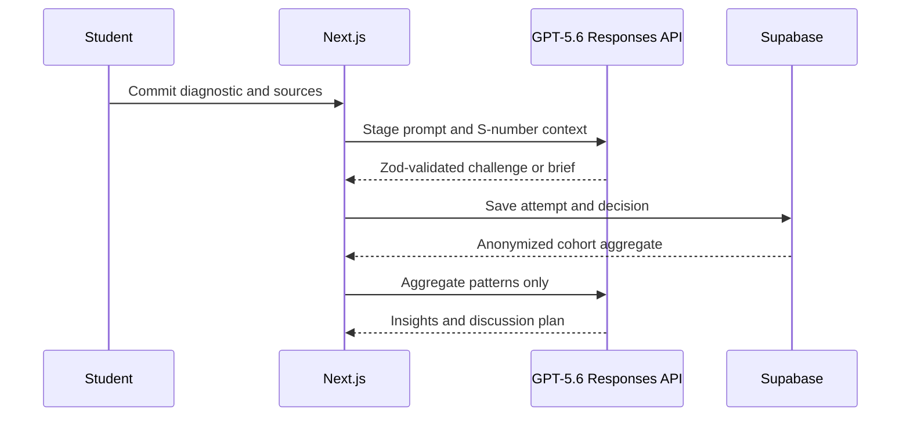

# Architecture

## System boundaries

The App Router renders role-specific surfaces. Browser state supports the zero-credential demo. Server routes own all OpenAI calls, so API keys and prompts never enter client bundles. Responses are parsed against feature-specific Zod schemas; missing keys use shape-compatible fixtures.

## Data and authorization

`supabase/schema.sql` models profiles, courses, enrollments, cases, sources, assignments, objectives, attempts, responses, conversations, decisions, briefs, reflections, and insights. Student rows are owner-scoped; course faculty access aggregate insight. Storage paths belong on `case_sources`, with MIME, size, and malware checks required before extraction.

## AI contracts and failures

Each feature has its own prompt and schema. Shared rules enforce source grounding, assumption/inference separation, concise questioning, anonymity, and no automated grading. The route layer handles missing keys, rate limits, invalid structured output, empty input, unsupported feature, and timeouts.

## Future multi-tenancy

Add `institutions` and `institution_id`, enforce tenant membership in RLS, use tenant-scoped storage, encryption/retention settings, auditable faculty releases, and k-anonymous cohort RPCs. This is deferred until the learning wedge is validated.
