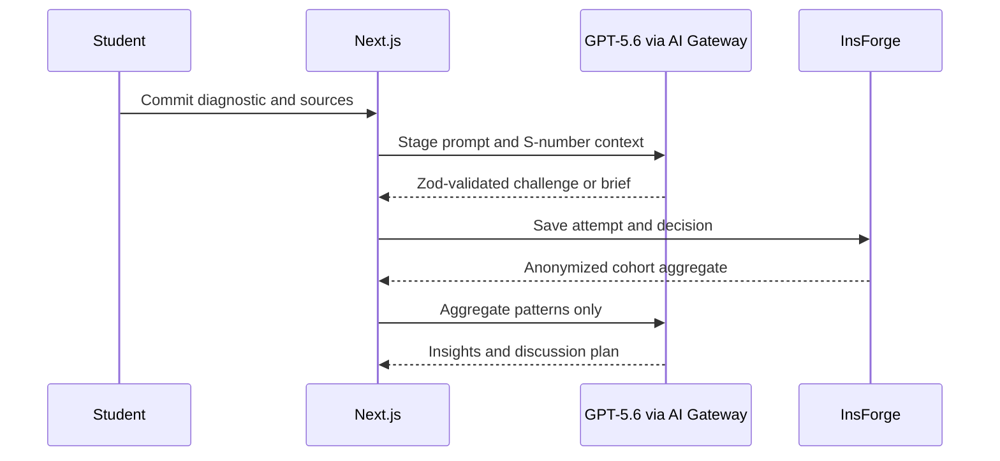

# Architecture

## System boundaries

The App Router renders role-specific surfaces. Browser state supports the zero-credential demo. Server routes own all model calls, so Gateway credentials and prompts never enter client bundles. The Vercel AI SDK routes GPT-5.6 through AI Gateway using deployment OIDC or a local server-only Gateway key. Responses are parsed against feature-specific Zod schemas; demo mode and recoverable live failures use shape-compatible fixtures.

## Data and authorization

`migrations/20260719113221_caseflow-persistence-v1.sql` models profiles, courses, enrollments, cases, sources, assignments, objectives, attempts, responses, conversations, decisions, briefs, reflections, and insights on InsForge Postgres. SSR auth keeps refresh credentials httpOnly. Student writes use narrow authenticated RPCs, all private rows carry a direct `student_id`, and RLS provides owner isolation. `migrations/20260720080830_enforce-cohort-anonymity.sql` removes direct faculty reads of enrollment identities, attempt metadata, and stored insight counts. Faculty cohort access is assignment-and-course-role gated, and synthetic representative responses are disconnected from auth identities. The faculty server DAL calls only `get_caseflow_cohort_summary`, which releases aggregate counts and bounded anonymous arguments only when the course threshold is met. The threshold defaults to five and cannot be configured below five. Below it, the RPC returns only suppression metadata—never the small count. The DAL strictly validates both released and suppressed shapes; unexpected identity, raw-response, or brief fields fail closed. Storage URLs and keys belong together on `case_sources`, with MIME, size, and malware checks required before future extraction.

`migrations/20260720090000_pilot-feedback-ingestion.sql` adds two explicit publication boundaries. Rubrics and shared faculty feedback remain drafts until a faculty member releases them; students can read only released content. Uploaded PDF/DOCX material is validated and extracted server-side, stored in the private `case-materials` bucket, registered as a pending source, and hidden from students until a faculty review approves it. Raw storage objects remain faculty-only. Approved text receives an `S1`–`S99` identifier and is supplied to the existing AI citation validator. The local signature screening is defense in depth for a pilot and does not claim to replace managed antivirus scanning.

The app retains a strict mode boundary: `NEXT_PUBLIC_PERSISTENCE_ENABLED=false` preserves the credential-free demo; `true` requires authentication and treats InsForge as the source of truth while keeping browser storage only as a recovery cache.

## AI contracts and failures

Each feature has its own prompt and schema. Shared rules enforce source grounding, assumption/inference separation, concise questioning, anonymity, and no automated grading. Source identifiers are schema-constrained to `[S1]`–`[S5]` and cross-checked against the sources supplied to each request before any live response is returned. The Socratic prompt explicitly forbids choosing an entry mode for the student. The route layer limits request size and handles rate limits, invalid structured output, empty input, unsupported features, timeouts, and budget/provider failures. With `AI_FALLBACK_ON_ERROR=true`, provider and validation errors degrade to the deterministic, schema-validated response and identify the result as `fallback` mode.

`DEMO_MODE=false` is the explicit live-AI switch. `AI_GATEWAY_MODEL`, `AI_REASONING_EFFORT`, the output-token budget, and the 5–60 second timeout are server-side configuration. The production default is `openai/gpt-5.6-terra` at `medium` effort for balanced interactive quality, latency, and cost; `openai/gpt-5.6-sol` can be selected for measured quality-first workloads and `openai/gpt-5.6-luna` for measured high-volume workloads.

## Future multi-tenancy

Add `institutions` and `institution_id`, enforce tenant membership in RLS, use tenant-scoped storage, encryption/retention settings, and auditable faculty releases. Course-scoped k-anonymous cohort RPCs are now enforced; institution-level privacy controls remain deferred until the learning wedge is validated.
