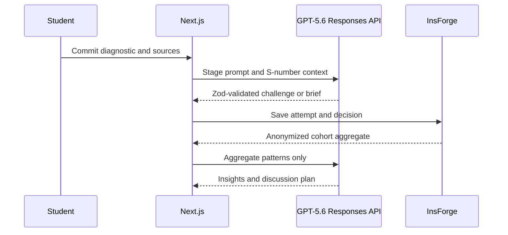

# Architecture

## System boundaries

The App Router renders role-specific surfaces. Browser state supports the zero-credential demo. Server routes own all OpenAI calls, so API keys and prompts never enter client bundles. Responses are parsed against feature-specific Zod schemas; missing keys use shape-compatible fixtures.

## Data and authorization

`migrations/20260719113221_caseflow-persistence-v1.sql` models profiles, courses, enrollments, cases, sources, assignments, objectives, attempts, responses, conversations, decisions, briefs, reflections, and insights on InsForge Postgres. SSR auth keeps refresh credentials httpOnly. Student writes use narrow authenticated RPCs, all private rows carry a direct `student_id`, and RLS provides owner isolation. Faculty cohort access is course-role gated and synthetic representative responses are disconnected from auth identities. The faculty server DAL calls only `get_caseflow_cohort_summary` and strictly accepts aggregate counts plus bounded anonymous arguments; it does not query `student_responses`, student identities, or preparation briefs. Unexpected fields fail closed. Storage URLs and keys belong together on `case_sources`, with MIME, size, and malware checks required before future extraction.

The app retains a strict mode boundary: `NEXT_PUBLIC_PERSISTENCE_ENABLED=false` preserves the credential-free demo; `true` requires authentication and treats InsForge as the source of truth while keeping browser storage only as a recovery cache.

## AI contracts and failures

Each feature has its own prompt and schema. Shared rules enforce source grounding, assumption/inference separation, concise questioning, anonymity, and no automated grading. The route layer handles missing keys, rate limits, invalid structured output, empty input, unsupported feature, and timeouts.

## Future multi-tenancy

Add `institutions` and `institution_id`, enforce tenant membership in RLS, use tenant-scoped storage, encryption/retention settings, auditable faculty releases, and k-anonymous cohort RPCs. This is deferred until the learning wedge is validated.
