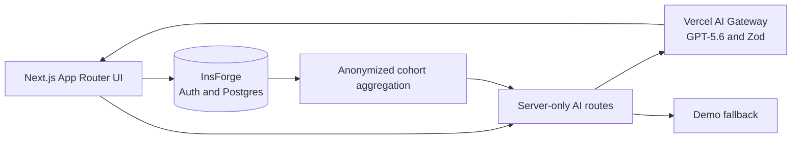

# CaseFlow

CaseFlow is an AI-native learning workspace for MBA case-method education. It helps students form independent, evidence-grounded judgment before class and helps faculty turn cohort reasoning into a stronger live discussion.

> All people, organizations, responses, and figures in the demo are synthetic and fictional.

## Problem

Students often arrive with summaries rather than defensible positions. Faculty receive repetitive preparation notes but little visibility into cohort misconceptions, confidence, or productive disagreement. Generic “chat with a PDF” tools can shortcut the reasoning case teaching is meant to develop.

## Solution and workflows

CaseFlow embeds AI in a learning loop: material → diagnostic → Socratic preparation → committed decision → preparation brief → cohort insight → classroom discussion → reflection.

- **Student:** dashboard → diagnostic → Socratic challenges → decision checkpoint → source-linked brief → reflection comparison.
- **Faculty:** dashboard → derived recommendation/confidence metrics → evidence and reasoning-gap analysis → anonymized arguments → editable 60/90-minute plan.

## Why it is AI-native

- The model sees the student’s evolving argument, cited case context, and commitment stage—not only a document and chat prompt.
- Student work becomes a structured brief; anonymized cohort patterns become faculty discussion inputs.
- Pre/post comparison describes how assumptions and evidence changed.
- Every generative feature has a narrow educational contract, Zod schema, grounding rules, and deterministic fallback.
- Faculty remain responsible for rubrics, teaching plans, and released feedback; there is no automated high-stakes grading.

## Architecture



Prompts live in `src/lib/ai/prompts`, validation schemas in `src/lib/ai/schemas.ts`, and model orchestration in `src/lib/ai/service.ts`. Synthetic data live in `src/lib/data.ts`; faculty metrics are derived in `src/lib/analytics.ts`. See [ARCHITECTURE.md](./ARCHITECTURE.md).

## Local setup and demo accounts

```bash
npm install
cp .env.example .env.local
npm run dev
```

Open `http://localhost:3000/demo`. Demo mode needs no external account. Choose **Student (Maya)** or **Faculty (Professor Tanaka)**; the role switcher remains available.

## Environment variables

| Variable | Required | Purpose |
|---|---:|---|
| `DEMO_MODE` | No | Live AI is enabled only when explicitly set to `false` |
| `AI_GATEWAY_MODEL` | No | Defaults to balanced `openai/gpt-5.6-terra`; Sol and Luna remain configurable |
| `AI_REASONING_EFFORT` | No | Defaults to `medium`; accepts `none`, `low`, `medium`, `high`, or `xhigh` |
| `AI_REQUEST_TIMEOUT_MS` | No | Total live-generation timeout; defaults to 30 seconds |
| `AI_MAX_OUTPUT_TOKENS` | No | Structured response budget; defaults to 2,000 |
| `AI_FALLBACK_ON_ERROR` | No | Defaults to `true`, returning a validated deterministic response after provider or schema failure |
| `AI_GATEWAY_API_KEY` | Local live AI only | Optional server-only Gateway key; Vercel deployments use OIDC automatically |
| `NEXT_PUBLIC_PERSISTENCE_ENABLED` | No | `true` enables InsForge accounts and durable student work |
| `NEXT_PUBLIC_INSFORGE_URL` | Persistence only | InsForge project URL |
| `NEXT_PUBLIC_INSFORGE_ANON_KEY` | Persistence only | Browser-safe InsForge anon key |
| `NEXT_PUBLIC_APP_URL` | Persistence only | Public origin used for auth redirects |

### Authentication configuration

InsForge owns access/refresh cookie names, expiration, rotation, and cookie attributes through `@insforge/sdk/ssr`. The refresh credential is `HttpOnly`; cookies use `SameSite=Lax`, become `Secure` in production, use path `/`, and expire with their JWT. CaseFlow does not store authentication tokens in browser storage.

Email verification redirects must be exact, allowlisted app URLs. The committed `insforge.toml` proposes:

- `http://localhost:3000/login`
- `https://caseloop-zeta.vercel.app/login`

Before enabling verification on another origin, add its exact `/login` URL to `auth.allowed_redirect_urls`, set `NEXT_PUBLIC_APP_URL` to that HTTPS origin, review with `npx @insforge/cli config plan`, and apply only after approval. Preview deployment URLs are not automatically trusted. InsForge SMTP currently enforces a 60-second minimum interval, and the UI never retries verification email automatically.

## Testing

```bash
npm run lint
npm run typecheck
npm test
npm run test:e2e:install
npm run test:e2e
npm run build
```

Unit tests cover exact cohort aggregation, authorization boundaries, authentication behavior, and structured AI fallback validation. The deterministic Playwright suite starts isolated demo and authentication-contract servers, uses a local fake InsForge boundary, and requires no credentials or external writes. It covers the student preparation/reflection loop, reload recovery, faculty aggregate/privacy screens, protected routes, verification callbacks, and sanitized login errors.

### Live InsForge E2E

The optional live suite verifies real session cookies, student persistence, role redirects, faculty-only aggregates, privacy, and sign-out. It skips explicitly unless all six variables below are present:

```bash
export E2E_LIVE_BASE_URL="https://your-non-production-preview.example"
export E2E_STUDENT_EMAIL="dedicated-student@example.test"
export E2E_STUDENT_PASSWORD="..."
export E2E_FACULTY_EMAIL="dedicated-faculty@example.test"
export E2E_FACULTY_PASSWORD="..."
export E2E_NON_PRODUCTION_CONFIRM="true"
npm run test:e2e:live
```

Use a preview deployment connected to an isolated InsForge backend branch and dedicated test accounts. The student test overwrites that account’s fictional diagnostic. The suite refuses the known CaseFlow production hostname, never creates accounts, and does not reset or query the database out of band. Live traces and videos are disabled so credentials are not retained in Playwright artifacts.

## Pilot controls and secure case material

Faculty can edit a bounded reasoning rubric, keep it as a faculty-only draft, and explicitly release or withdraw the rubric and shared post-class feedback. Released content is course-scoped and intentionally contains no automated grade or individual student response.

PDF and DOCX ingestion is available only to authenticated faculty when persistence is enabled. The server enforces a 4 MB limit, extension/MIME/magic-byte agreement, SHA-256 hashing, plain-text extraction, macro and active-PDF rejection, an EICAR test-signature check, private storage, and a pending-review quarantine. Approved sources receive stable `S` identifiers and are then loaded into the student evidence panel and live AI context. This built-in screening is a pilot control, not a substitute for a managed antivirus scanner; institutions should add a full malware-scanning service before accepting untrusted public uploads.

AI behavior also has an offline-first evaluation harness covering all five workflows. `npm run eval:ai` is deterministic and makes no provider calls; `npm run eval:ai:json` emits CI-friendly JSON. See [docs/AI_EVALUATIONS.md](./docs/AI_EVALUATIONS.md) for scorers, thresholds, exit codes, and the double-locked live Gateway command.

## Database

The versioned SQL in `migrations/` is applied with `npx @insforge/cli db migrations up --all`. It creates the requested entities, timestamp triggers, owner-scoped student records, role-aware RLS, guarded persistence RPCs, and 12 anonymous fictional cohort responses. New accounts are students by default; a project administrator promotes faculty through the InsForge CLI or dashboard. The zero-credential demo continues to read `src/lib/data.ts`.

Faculty analytics are loaded server-side through `get_caseflow_cohort_summary`. The RPC resolves the requested assignment to its course, denies faculty from other courses, and releases completed count, average confidence, position counts, and a bounded set of anonymous representative arguments only after the course anonymity threshold is met. `courses.cohort_minimum_size` defaults to 5, is constrained to 5–50, and may be raised per course. Below the threshold, the RPC returns only `{ suppressed: true, minimumCohortSize }`; it does not reveal the exact small count. Its response is strictly schema-validated before rendering: sub-threshold releases, unexpected identity fields, raw student responses, and preparation briefs are rejected rather than passed to the UI. Evidence counts shown in the insight screen are explicitly limited to the representative sample.

The pilot migration also requires a private InsForge Storage bucket named `case-materials`:

```bash
npx @insforge/cli storage create-bucket case-materials --private
npx @insforge/cli db migrations up --all
```

Create and test the bucket and migration on an InsForge backend branch before merging them into the parent project. Storage RLS limits uploads and raw-file reads to faculty enrolled in the course; students receive only approved, extracted source text through application-table RLS.

## Deploy to Vercel

1. Import this repository; use the Next.js preset and repository root.
2. Set `DEMO_MODE=true` for credential-free judging.
3. Enable AI Gateway for the Vercel project, set `DEMO_MODE=false`, and optionally select `AI_GATEWAY_MODEL=openai/gpt-5.6-terra` and `AI_REASONING_EFFORT=medium`. Vercel authenticates Gateway requests with OIDC; do not add provider credentials to `NEXT_PUBLIC_*` variables.
4. To enable durable accounts, add the InsForge variables above and set `NEXT_PUBLIC_PERSISTENCE_ENABLED=true`.
5. Verify `/demo`, both dashboards, the Hikari workspace, brief, cohort insight, and discussion plan.

## Privacy and academic integrity

- Synthetic data only; identifiable responses are never exposed to peers.
- Source IDs accompany generated claims; UI separates facts, assumptions, and inference.
- No model answer and no automated high-stakes grading.
- Faculty edit and control generated teaching content.
- Production aggregation uses a course-scoped security-definer RPC with a minimum cohort threshold of five.

## How Codex and GPT-5.6 were used

Codex was the implementation partner across repository setup, product/data design, UX, implementation, synthetic seeds, failure states, tests, documentation, and verification. Inside the app, GPT-5.6 is invoked through the Vercel AI SDK and AI Gateway using five separate server-side prompts and Zod structured outputs: Socratic coaching, preparation brief, cohort analysis, discussion planning, and reflection comparison. The default is GPT-5.6 Terra at medium reasoning for an interactive quality/latency balance; model and effort remain environment-driven. The supported Gateway model IDs were verified against the [Vercel GPT-5.6 announcement](https://vercel.com/changelog/gpt-5-6-now-available-on-ai-gateway) and [OpenAI model catalog](https://developers.openai.com/api/docs/models).

## Known limitations

- Demo-mode progress remains browser-local by design; live persistence uses InsForge.
- Faculty promotion is an administrator operation; self-service course administration and live file parsing are not included.
- Demo coaching is deterministic; live mode uses AI Gateway and automatically returns the same validated fallback shape when a provider call or structured response fails.
- RLS and k-anonymous faculty aggregation are foundational controls, not a completed production security audit.
- Pilot document screening blocks common active-content and test-malware signatures, but institutional use still requires a managed malware scanner and OCR for image-only PDFs.
- Analytics represent 12 completed synthetic responses in a fictional 24-student cohort.
