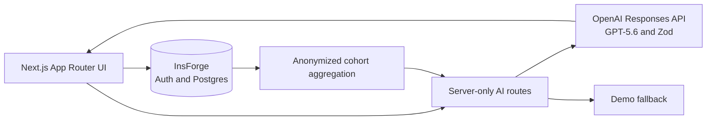

# CaseFlow

CaseFlow is an AI-native learning workspace for MBA case-method education. It helps students form independent, evidence-grounded judgment before class and helps faculty turn cohort reasoning into a stronger live discussion.

> All people, organizations, responses, and figures in the demo are synthetic and fictional.

## Problem

Students often arrive with summaries rather than defensible positions. Faculty receive repetitive preparation notes but little visibility into cohort misconceptions, confidence, or productive disagreement. Generic “chat with a PDF” tools can shortcut the reasoning case teaching is meant to develop.

## Solution and workflows

CaseFlow embeds AI in a learning loop: material → diagnostic → Socratic preparation → committed decision → preparation brief → cohort insight → classroom discussion → reflection.

- **Student:** dashboard → diagnostic → Socratic challenges → decision checkpoint → source-linked brief → reflection comparison.
- **Faculty:** dashboard → derived recommendation/confidence metrics → evidence and reasoning-gap analysis → anonymized arguments → editable 60/90-minute plan.

## Why it is AI-native

- The model sees the student’s evolving argument, cited case context, and commitment stage—not only a document and chat prompt.
- Student work becomes a structured brief; anonymized cohort patterns become faculty discussion inputs.
- Pre/post comparison describes how assumptions and evidence changed.
- Every generative feature has a narrow educational contract, Zod schema, grounding rules, and deterministic fallback.
- Faculty remain responsible for rubrics, teaching plans, and released feedback; there is no automated high-stakes grading.

## Architecture



Prompts live in `src/lib/ai/prompts`, validation schemas in `src/lib/ai/schemas.ts`, and model orchestration in `src/lib/ai/service.ts`. Synthetic data live in `src/lib/data.ts`; faculty metrics are derived in `src/lib/analytics.ts`. See [ARCHITECTURE.md](./ARCHITECTURE.md).

## Local setup and demo accounts

```bash
npm install
cp .env.example .env.local
npm run dev
```

Open `http://localhost:3000/demo`. Demo mode needs no external account. Choose **Student (Maya)** or **Faculty (Professor Tanaka)**; the role switcher remains available.

## Environment variables

| Variable | Required | Purpose |
|---|---:|---|
| `DEMO_MODE` | No | `true` uses reliable structured fallbacks |
| `OPENAI_API_KEY` | Live AI only | Server-side OpenAI key |
| `OPENAI_MODEL` | No | Defaults to `gpt-5.6` |
| `NEXT_PUBLIC_PERSISTENCE_ENABLED` | No | `true` enables InsForge accounts and durable student work |
| `NEXT_PUBLIC_INSFORGE_URL` | Persistence only | InsForge project URL |
| `NEXT_PUBLIC_INSFORGE_ANON_KEY` | Persistence only | Browser-safe InsForge anon key |
| `NEXT_PUBLIC_APP_URL` | Persistence only | Public origin used for auth redirects |

### Authentication configuration

InsForge owns access/refresh cookie names, expiration, rotation, and cookie attributes through `@insforge/sdk/ssr`. The refresh credential is `HttpOnly`; cookies use `SameSite=Lax`, become `Secure` in production, use path `/`, and expire with their JWT. CaseFlow does not store authentication tokens in browser storage.

Email verification redirects must be exact, allowlisted app URLs. The committed `insforge.toml` proposes:

- `http://localhost:3000/login`
- `https://caseloop-zeta.vercel.app/login`

Before enabling verification on another origin, add its exact `/login` URL to `auth.allowed_redirect_urls`, set `NEXT_PUBLIC_APP_URL` to that HTTPS origin, review with `npx @insforge/cli config plan`, and apply only after approval. Preview deployment URLs are not automatically trusted. InsForge SMTP currently enforces a 60-second minimum interval, and the UI never retries verification email automatically.

## Testing

```bash
npm run lint
npm run typecheck
npm test
npm run build
```

Tests cover exact cohort aggregation and structured AI fallback validation.

## Database

The versioned SQL in `migrations/` is applied with `npx @insforge/cli db migrations up --all`. It creates the requested entities, timestamp triggers, owner-scoped student records, role-aware RLS, guarded persistence RPCs, and 12 anonymous fictional cohort responses. New accounts are students by default; a project administrator promotes faculty through the InsForge CLI or dashboard. The zero-credential demo continues to read `src/lib/data.ts`.

Faculty analytics are loaded server-side through `get_caseflow_cohort_summary`. The RPC is course-role gated and returns only completed count, average confidence, position counts, and a bounded set of anonymous representative arguments. Its response is strictly schema-validated before rendering: unexpected identity fields, raw student responses, and preparation briefs are rejected rather than passed to the UI. Evidence counts shown in the insight screen are explicitly limited to the representative sample.

## Deploy to Vercel

1. Import this repository; use the Next.js preset and repository root.
2. Set `DEMO_MODE=true` for credential-free judging.
3. For live AI, set `DEMO_MODE=false`, `OPENAI_API_KEY`, and `OPENAI_MODEL=gpt-5.6`.
4. To enable durable accounts, add the InsForge variables above and set `NEXT_PUBLIC_PERSISTENCE_ENABLED=true`.
5. Verify `/demo`, both dashboards, the Hikari workspace, brief, cohort insight, and discussion plan.

## Privacy and academic integrity

- Synthetic data only; identifiable responses are never exposed to peers.
- Source IDs accompany generated claims; UI separates facts, assumptions, and inference.
- No model answer and no automated high-stakes grading.
- Faculty edit and control generated teaching content.
- Production aggregation should use a security-definer RPC and minimum anonymity threshold.

## How Codex and GPT-5.6 were used

Codex was the implementation partner across repository setup, product/data design, UX, implementation, synthetic seeds, failure states, tests, documentation, and verification. Inside the app, GPT-5.6 is configured with `OPENAI_MODEL` and invoked through the official SDK’s Responses API using five separate server-side prompts and Zod structured outputs: Socratic coaching, preparation brief, cohort analysis, discussion planning, and reflection comparison.

## Known limitations

- Demo-mode progress remains browser-local by design; live persistence uses InsForge.
- Faculty promotion is an administrator operation; self-service course administration and live file parsing are not included.
- Demo coaching is deterministic; live mode uses the API.
- RLS is foundational, not a completed production security audit.
- Analytics represent 12 completed synthetic responses in a fictional 24-student cohort.
