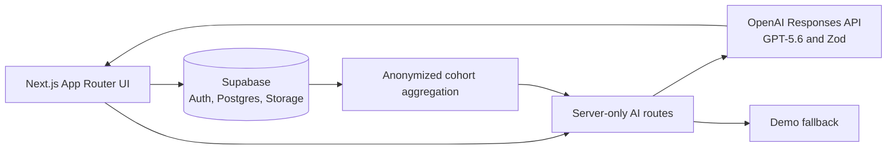

# CaseFlow

CaseFlow is an AI-native learning workspace for MBA case-method education. It helps students form independent, evidence-grounded judgment before class and helps faculty turn cohort reasoning into a stronger live discussion.

> All people, organizations, responses, and figures in the demo are synthetic and fictional.

## Problem

Students often arrive with summaries rather than defensible positions. Faculty receive repetitive preparation notes but little visibility into cohort misconceptions, confidence, or productive disagreement. Generic “chat with a PDF” tools can shortcut the reasoning case teaching is meant to develop.

## Solution and workflows

CaseFlow embeds AI in a learning loop: material → diagnostic → Socratic preparation → committed decision → preparation brief → cohort insight → classroom discussion → reflection.

- **Student:** dashboard → diagnostic → Socratic challenges → decision checkpoint → source-linked brief → reflection comparison.
- **Faculty:** dashboard → derived recommendation/confidence metrics → evidence and reasoning-gap analysis → anonymized arguments → editable 60/90-minute plan.

## Why it is AI-native

- The model sees the student’s evolving argument, cited case context, and commitment stage—not only a document and chat prompt.
- Student work becomes a structured brief; anonymized cohort patterns become faculty discussion inputs.
- Pre/post comparison describes how assumptions and evidence changed.
- Every generative feature has a narrow educational contract, Zod schema, grounding rules, and deterministic fallback.
- Faculty remain responsible for rubrics, teaching plans, and released feedback; there is no automated high-stakes grading.

## Architecture



Prompts live in `src/lib/ai/prompts`, validation schemas in `src/lib/ai/schemas.ts`, and model orchestration in `src/lib/ai/service.ts`. Synthetic data live in `src/lib/data.ts`; faculty metrics are derived in `src/lib/analytics.ts`. See [ARCHITECTURE.md](./ARCHITECTURE.md).

## Local setup and demo accounts

```bash
npm install
cp .env.example .env.local
npm run dev
```

Open `http://localhost:3000/demo`. Demo mode needs no external account. Choose **Student (Maya)** or **Faculty (Professor Tanaka)**; the role switcher remains available.

## Environment variables

| Variable | Required | Purpose |
|---|---:|---|
| `DEMO_MODE` | No | `true` uses reliable structured fallbacks |
| `OPENAI_API_KEY` | Live AI only | Server-side OpenAI key |
| `OPENAI_MODEL` | No | Defaults to `gpt-5.6` |
| `NEXT_PUBLIC_SUPABASE_URL` | Persistence only | Supabase URL |
| `NEXT_PUBLIC_SUPABASE_ANON_KEY` | Persistence only | Browser-safe anon key |
| `SUPABASE_SERVICE_ROLE_KEY` | Server jobs only | Never expose to browser |

## Testing

```bash
npm run lint
npm run typecheck
npm test
npm run build
```

Tests cover exact cohort aggregation and structured AI fallback validation.

## Database

Run `supabase/schema.sql`, then `supabase/seed.sql`. The schema contains the requested entities, timestamps, indexes, RLS foundations, and student/faculty policies. The demo reads `src/lib/data.ts` so judging never depends on credentials.

## Deploy to Vercel

1. Import this repository; use the Next.js preset and repository root.
2. Set `DEMO_MODE=true` for credential-free judging.
3. For live AI, set `DEMO_MODE=false`, `OPENAI_API_KEY`, and `OPENAI_MODEL=gpt-5.6`.
4. Add Supabase variables after applying schema and RLS.
5. Verify `/demo`, both dashboards, the Hikari workspace, brief, cohort insight, and discussion plan.

## Privacy and academic integrity

- Synthetic data only; identifiable responses are never exposed to peers.
- Source IDs accompany generated claims; UI separates facts, assumptions, and inference.
- No model answer and no automated high-stakes grading.
- Faculty edit and control generated teaching content.
- Production aggregation should use a security-definer RPC and minimum anonymity threshold.

## How Codex and GPT-5.6 were used

Codex was the implementation partner across repository setup, product/data design, UX, implementation, synthetic seeds, failure states, tests, documentation, and verification. Inside the app, GPT-5.6 is configured with `OPENAI_MODEL` and invoked through the official SDK’s Responses API using five separate server-side prompts and Zod structured outputs: Socratic coaching, preparation brief, cohort analysis, discussion planning, and reflection comparison.

## Known limitations

- Demo progress is browser-local; Supabase persistence is a documented production seam.
- Authentication UI and live file parsing are not wired into this hackathon build.
- Demo coaching is deterministic; live mode uses the API.
- RLS is foundational, not a completed production security audit.
- Analytics represent 12 completed synthetic responses in a fictional 24-student cohort.
